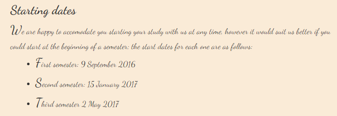

# 05.Carta Tunning



Este es la quinta practica realizada en el BootCamp de TheBridge.

## Objetivo

Darle estilos a la carta realizada en la 1ª practica, en mi caso he decidio realizarla de una forma "Elegante", simulando una carta escrita a mano.

## Reto personal

Me he propuesto usar una funcion que hacia mucho que no utilizaba, se trata de min() o max(), las cuales ayudan mucho a la hora de evitar usar MediaQueries y siempre añaden un plus de responsividad "natural", el codigo que he utilizado es el siguiente:

```css
body {
    margin: 4rem auto; /* #1 */
    background-color: antiquewhite;
    width: min(65rem, 80vw); /* #2 */
}                            
```

- En el punto #1 he usado el viejo confiable `margin:auto`, de esta forma aseguro que body queda 100% centrado horizontalmente.
- El el punto #2 he usado la funcion `min( )` en el `width` del body, la finalidad de esta funcion es asegurarte de que siempre se usa el tamaño mas pequeño de dentro de ella, para que esto funcione es necesario que *SIEMPRE* haya un valor estatico y otro dinamico y el funcionamiento es el siguiente (Vision desde MobileFirst):
    - El tamaño del body es del 80% del ancho de la pantalla (80vw)
    - Puede crecer hasta alcanzar un maximo de 65rem (En este caso equivale a 650px)
    - Una vez alcanzados los 65rem el body no crece más, se queda en este tamaño

## OneMoreThing

La hoja de estilos (CSS) la he escrito basandome en etiquetas basicas, de tal forma que si se le aplicase a otra "carta" seguramente no haría falta aplicarle practicamente ninguna modificación y esta quedaria con un estilo correcto y muy similar al HTML escrito.

